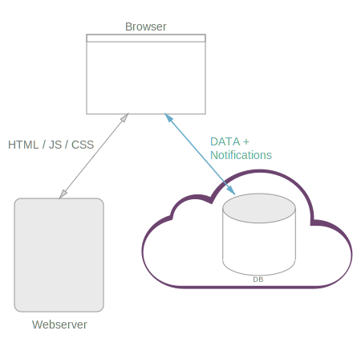

# Collaborative Todo-App with Jet

This article demonstrates how to create a realtime collaborative Todo-App with
[Jet](http://jetbus.io). The App will be able to:

   - Create/delete Todos
   - Edit Todos
   - Simultanoeous working of multiple users
   - Sort Todos


## What is Jet?
 
In many ways Jet is similar to [Pusher](http://pusher.com) or [Firebase](http://firebase.com) as it
can be used as backbone for distributed realtime Apps.
But Jet has some notable differences:

   - Self-hosted
   - Fully customizable backend-logic (e.g. validation)
   - Flexible realtime filters
   - Flexible realtime sorting


Self-hosted means that running Jet does not involve any 3rd party servers where your data passes through.
Instead the Jet Daemon runs on **your** machine and can be easily embedded into your
node based webserver. As such Jet is free and open source.




## Project setup

For this project we need:

   - Jet
   - Webserver


The webserver is required for serving the static file content (HTML/JS/CSS).

```sh
npm install http-server
npm install node-jet
```

Subsequently we will create these files:

   - todo-server.js
   - todo-client.js
   - index.html

## todo-server.js
 
First we will setup the webserver for static files and create a Jet Daemon:

```javascript
var jet = require('node-jet');
...

// Serve this dir as static content 
var serve = serveStatic('./');

var httpServer = http.createServer(function(req, res){
  var done = finalhandler(req, res)
  serve(req, res, done)
})
 
httpServer.listen(port);

// Create jet daemon and embed into httpServer
var daemon = new jet.Daemon();
daemon.listen({
  server: httpServer
});
```

The Jet [Daemon](https://github.com/lipp/node-jet/blob/master/doc/daemon.md) uses Websockets 
for communication and is hooked up into the webserver so that
both listen on the same port. If required, the Daemon may run on a different port or even on another
machine.

Next we will provide the Todo-App service.

In order to provide services or content with Jet, you need a [Peer](https://github.com/lipp/node-jet/blob/master/doc/peer.md).
Peers connect to the Daemon and register their content (States and Methods).
The Todo-Server Peer will be able to:

   - create/delete single Todos
   - let Todos change
   - delete all Todos at once

For actions (services) Jet provides **Methods**. They are defined by a unique **path** and a function, 
which gets executed when the method is called by another Peer. This snippet adds a "service" which prints
two arguments to the console:

```javascript
peer.method({
  path: 'print',
  call: function(a, b) {
    console.log(a, b);
  }
});
```

