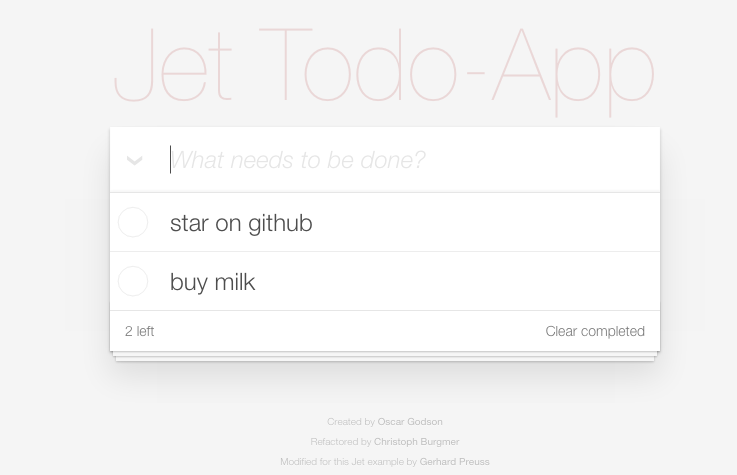

# Collaborative Todo-App with Jet

In this article I demonstrate how to create a realtime collaborative Todo-App with
[Jet](http://jetbus.io). The App will be able to:

   - Create/delete Todos
   - Edit Todos
   - Work simultaneously with multiple users
	
Working simlutaneously means, that multiple users can edit the todo-list
at the same time and everyone sees each other's changes instantly.

The complete project source is available [here](https://github.com/lipp/node-jet/tree/master/examples/todo).
To build and run this project run:

```sh
git clone http://github.com/lipp/node-jet
cd node-jet/examples/todo
npm install
npm run build
npm start 8090
```

Open some Browser tabs on [localhost port 8090](http://localhost:8090) and watch realtime changes.

If everything works fine, you should see something like this:

[](http://jetbus.io:8080)

## What is Jet?
 
In many ways Jet is similar to [Pusher](http://pusher.com) or [Firebase](http://firebase.com) as it
can be used as backbone for distributed realtime Apps.
However, Jet has some notable differences:

   - Self-hostable
   - Fully customizable backend-logic (e.g. validation)
   - Flexible realtime filters
   - Flexible realtime sorting (low-traffic)
   - Distributed Services / Content


Self-hosted means that running **Jet does not involve any 3rd party servers** where your data passes through.
Instead the Jet Daemon runs on **your** machine and can be easily embedded into your
Node.js based webserver. 

Realtime filtering and sorting can save you a lot of bandwidth. Imagine you have records of 5000 players, but you
want to display only the ten female players with the highest score: **Jet only transmits the relevant data** (10 records!)
and updates in realtime.
You don't have to transmit all players over the wire and filter them at the client.

In fact, Jet is more than a Javascript framework for realtime communication. It is an open protocol with compatible implementations for

   - [Node.js + Browser](http://github.com/lipp/node-jet)
   - [Lua](http://github.com/lipp/lua-jet)
   - [Arduino](https://github.com/lipp/Arduino-Jet)
   - C (work in progress)


Jet is free and open source.


## How to use Jet

For this project I need:

   - Jet
   - Webserver


The webserver is required for serving the static file content (HTML/JS/CSS).
Subsequently I will create these files:

   - [todo-server.js](./todo-server.js) (Webserver + Jet Daemon + Jet Peer)
   - [todo-client.js](./todo-client.js) (Jet Peer)
   - [index.html](./index.html)

## The webserver

The todo-server.js will provide a webserver for serving static files and Jet Daemon as communication center. A Jet Peer will finally add the Todo-App logic be providing means for:

   - create Todos
   - delete Todos
   - let Todos change


### Static file server and Jet Daemon
 
First I will setup the webserver for static files and create a Jet Daemon:

```javascript
var jet = require('node-jet');
...

// Serve this dir as static content 
var serve = serveStatic('./');

var httpServer = http.createServer(function(req, res){
  var done = finalhandler(req, res)
  serve(req, res, done)
})
 
httpServer.listen(port);

// Create jet daemon and embed into httpServer
var daemon = new jet.Daemon();
daemon.listen({
  server: httpServer
});
```

The Jet [Daemon](https://github.com/lipp/node-jet/blob/master/doc/daemon.md) uses Websockets 
for communication and is hooked up to the webserver so that
both listen on the same port. If required, the Daemon may run on a different port or even on another
machine.

Next I will provide the Todo-App service, by creating a [Peer](https://github.com/lipp/node-jet/blob/master/doc/peer.md)
and connecting it to the Daemon.
But first it is necessary to understand the basics of Jet's core components: **States** and **Methods**.


### Jet Methods Primer

For defining actions Jet provides **Methods**. They are defined by a unique **path** and a **function**, 
which gets invoked when the Method is called by another Peer. This snippet adds a Method which prints
two arguments to the console:

```javascript
var print = new jet.Method('print');
print.on('call', function(a, b) {
  console.log(a, b);
});

peer.add(print);
```

Another Peer may now consume the "print" service like this:

```javascript
otherPeer.call('print', ['Hello', 'World']);
```

Methods may have **any JSON-compatible argument** type and may **return any JSON-compatible** value.
Read more on Methods in the [Doc](https://github.com/lipp/node-jet/blob/master/doc/peer.md#method--peermethoddesc-callbacks).

### Jet States Primer

A Jet State is similar to a database document. It has a unique **path** and an associated value, which can
be of any JSON-compatible type. A **set callback** can be specified, which allows the State to react on change requests.
If the set function does not throw, **a State-Change is posted automatically**.

```javascript

var francis = new jet.State('persons/#12342',{name: 'Francis', age: 33});

francis.on('set', function(requestedValue) {
  if (requestedValue.age < this.value().age) {
    throw new Error('Sorry, this is not possible');
  }
});

peer.add(francis);
```

Another Peer may try to modify States:

```javascript
peer.set('persons/#52A92d', {name: 'Francis U.', age: 34});

peer.set('persons/#52A92d', {name: 'Francis U.', age: 20})
  .then(function() {
    console.log('Francis just unaged');
  }).catch(function(err) {
    console.log('Damn', err);
  });
```

This is just a simple uncomplete example to show custom validation for change requests. Jet allows you to do anything
appropriate inside the set callback, like:

   - interpolating the requested value (partial changes)
   - custom validation
   - adapting the requested value

No matter what you do, all Peers will have the actual value of the State and **stay in sync**. 
 
### Implement the Todo-Service Peer

The following implementation also goes to the todo-server.js file. To group the Todo-App functionality
in a "namespace" I prefix all State and Method paths with "todo/". 

Create a Peer which connects to the local Daemon, an Object to store all Todo States and a simple Todo class.

```javascript
var peer = new jet.Peer({
  url: 'ws://localhost:' + port
});

var todoStates = {};

var todoId = 0;

var Todo = function(title) {
  if (typeof title !== 'string') {
    throw new Error('title must be a string');
  }
  this.id = todoId++;
  this.title = title;
  this.completed = false;
};

Todo.prototype.merge = function(other) {
  if (other.completed !== undefined) {
    this.completed = other.completed;
  }

  if (other.title !== undefined) {
    this.title = other.title;
  }
};

Todo.prototype.id = function() {
  return this.id;
};
```

Provide the **todo/add** Method, which will create a new Todo State when called.

```javascript
var addTodo = new jet.Method('todo/add');

addTodo.on('call', function (args) {
	var title = args[0];
	var todo = new Todo(title);

	// create a new todo state and store ref.
	var todoState = new jet.State('todo/#' + todo.id, todo);
	todoState.on('set', function (requestedTodo) {
		todo.merge(requestedTodo);
		return {
			value: todo
		};

	});
	todoStates[todo.id] = todoState;
	peer.add(todoState);
});
```

The **todo/remove** Method will remove the Todo with specified id.

```javascript
var removeTodo = new jet.Method('todo/remove');

removeTodo.on('call', function (args) {
	var todoId = args[0];
	if (todoStates[todoId]) {
		todoStates[todoId].remove();
		delete todoStates[todoId];
	}
});
```

## The Jet Client

The Peer running in the Browser will act as a "consumer" of the Methods and States the Todo-Server Peer provides.
It will:

   - **fetch** the Todo States to display them
   - call the **todo/add** Method to create Todos
   - call the **todo/remove** Method to delete Todos
   - edit States by calling **set**

### Jet Fetch Primer

Fetching is like having a realtime query. It provides you with initial values of States and keeps track of events.
These events include:

    - a new State has been added
    - a State has been removed
    - a State's value has changed

The Jet Daemon is able to filter and sort your fetch query based on **paths** and/or **values**. A callback must be provided
that will be invoked everytime something relevant happens. A fetch for getting the **top ten female players** could look like this:

```javascript
var topFemalePlayers = new jet.Fetcher()
  .path('startsWith', 'player/')
  .key('gender', 'equals', 'female')
  .sortByKey('score', 'number')
  .range(1, 10)
  .descending()
  .on('data', function(topFemalePlayersArray) {});

peer.fetch(topFemalePlayers);
```

Fetch is very powerful and is exmplained in more detail in the API [doc](https://github.com/lipp/node-jet/blob/master/doc/peer.md#fetch--peerfetchrule-fetchcb-callbacks). Note that there is no **get** call at all! That is because Jet wants to keep pollers out, since they may decrease system performance.


### Implement Todo-Client

The Todo-Client implementation is straight forward:

```javascript
var peer = new jet.Peer({url: 'ws://' + window.location.host});

var addTodo = function(title) {
  peer.call('todo/add', [title]);
};

var removeTodo = function(id) {
  peer.call('todo/remove', [id]);
};

var removeAllTodos = function() {
  peer.call('todo/remove', []);
};

var setTodoTitle = function(id, title) {
  peer.set('todo/#' + id, {title: title});
};

var setTodoCompleted = function(id, completed) {
  peer.set('todo/#' + id, {completed: completed});
};

var renderTodos = function(todos) {
  ...
};

var todos = new jet.Fetcher()
  .path('startsWith', 'todo/#')
  .sortByKey('id', 'number')
  .range(1, 30)
  .on('data', renderTodos);

peer.fetch(todos);
```

# Conclusion

In this article I showed you how to create a simple **realtime collaborative Todo-App**
with Node.js and Jet. The todo list can be edited by multiple users 
simultaneously and always stays in sync.
The Jet webserver performs server-side custom validation, which enables you to
keep your App integre and flexible at the same time.

You **don't need any cloud service** like Firebase or Pusher to write distributed realtime Apps and **keep
complete control** over your servers and your data.

At [HBM](http://www.hbm.com) the Jet protocol is used in production code of medium- and embedded-class devices 
and we are constantly working to improve it.

If you want to read more, checkout the [Jet Homepage](http://jetbus.io) or the github repositories:

   - [Jet for Node.js + Browser](http://github.com/lipp/node-jet)
   - [Jet for Lua](http://github.com/lipp/lua-jet)
   - [Jet for Arduino](https://github.com/lipp/Arduino-Jet)
